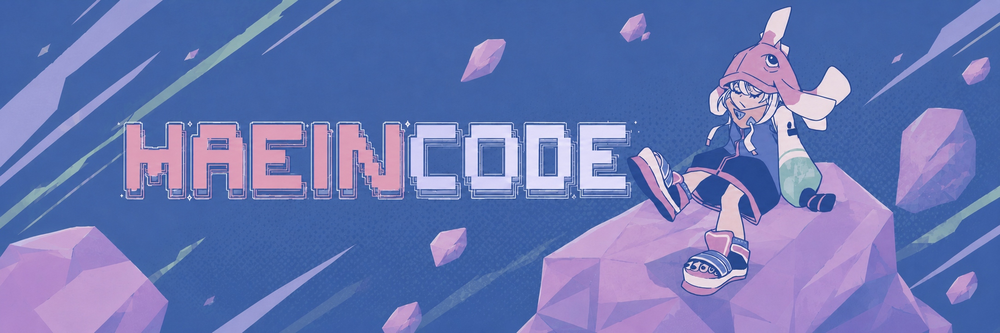

<!-- Banner -->
<p align="center">
  
</p>

<div align="center">

<!-- Name -->


<!-- Info pills -->
<p>
  
  
  
</p>

<!-- Connect With Me -->
<p>
  <a href="https://github.com/Ynhaein"></a>
  <a href="https://www.instagram.com/ynhaein88"></a>
  <a href="https://www.linkedin.com/in/"></a>
  <a href="https://gitlab.com/Ynhaein"></a>
  <a href="mailto:ynhaein@gmail.com"></a>
</p>

<!-- Banner Credit -->
<p>
  <a href="https://www.instagram.com/jixksee/"></a>
</p>

---

</div>


# About Me

```yaml
Name        : Yudhistira Dwi Putra Ambat
Age         : 17
Focus       : Full-Stack Development & UI/UX Design
Location    : Samarinda, Indonesia
Currently   : Building modern digital experiences
```

> Shin Haein's boyfriend :p


---

# Tech Stack

<p>
  
  
  
  
  
  
  
  
  
  
  
  
  
  
  
  
</p>
